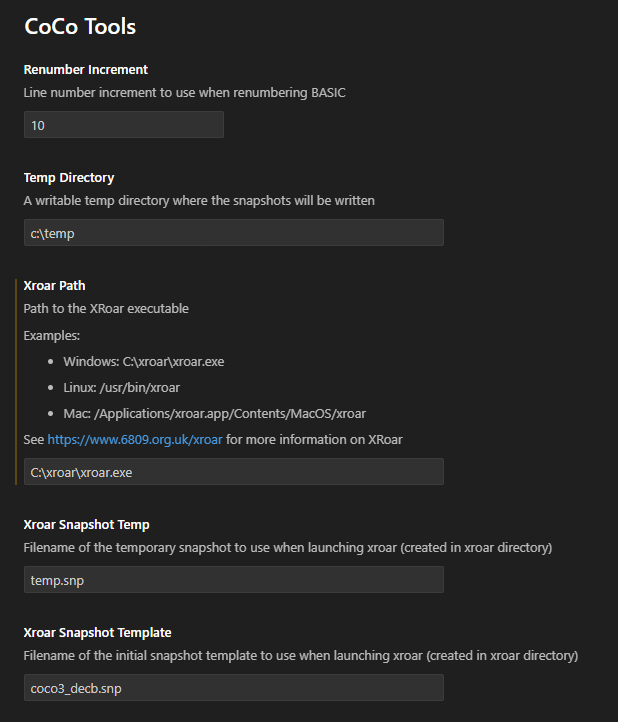
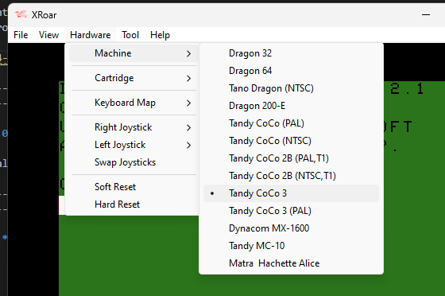
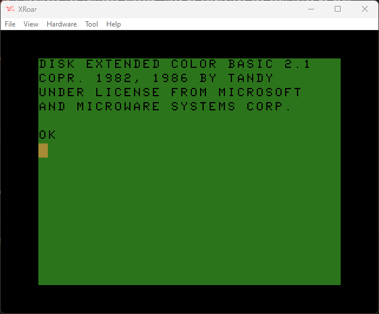

# CoCo Tools README

CoCoTools is a [VS Code extension](https://marketplace.visualstudio.com/items?itemName=jasonpittman.cocotools) that helps automate a Tandy Color Computer BASIC development.

## Features

The extension adds several features to the VS Code Command Palette (accessed by hitting Ctrl+Shift+P). These Include:

* `BASIC Renumber`: Renumbers the currently opened BASIC file in the same fashion that old RENUM statement works. Available from the Command Palette or Ctrl+Shift+r (Mac: Cmd+Shift+r)
* `Format BASIC`: Capitalizes keywords and trims leading spaces, so you can save time by mixing upper and lower case and improve visibility by indenting code blocks.
* `Remove Spaces`: Removes unnecessary spaces to make the program smaller.
* `Launch XRoar`: Launches XRoar with the currently opened BASIC file added to memory.  Available from the Command Palette or Ctrl+Shift+e (Mac: Cmd+Shift+e)

## Requirements

* XRoar with CoCo3 Disk Extended

## Extension Settings

I have tried to simplify the settings from previous versions so that it only includes a few simple settings.

* `Renumber Increment`: The increment used when renumbering BASIC. (10, 20, 30, etc....)
* `Temp Directory`: The extension needs access to a writable directory to create the snapshots it will use when launching XRoar. **You will need to change this to some directory on your local machine.**
* `XRoar Path`: The path to your XRoar executable. Examples show what your path might look like for Windows, Linux, and Mac. **You will need to change this to your XRoar executable.**
* `Snapshot Filenames`: These are the snapshots that the extension will use when launching XRoar. They will be created automatically in the Temp directory. You don't need to change these filenames, but you can if you want.

## Other

* This is a work in progress, and there are probably going to be 
* Currently ONLY supports CoCo3 Disk Extended. Your XRoar installation should have "coco3.rom" and "disk11.rom" available, and be able to be launched like this:

-----------------------------------------------------------------------------------------------------------

### 0.1.0

* Initial release of the updated CoCoTools

-----------------------------------------------------------------------------------------------------------

**Enjoy!**
